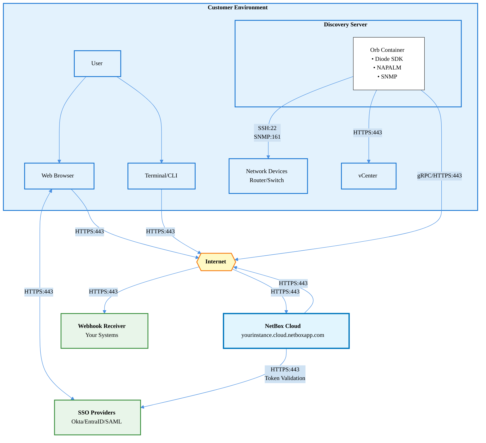
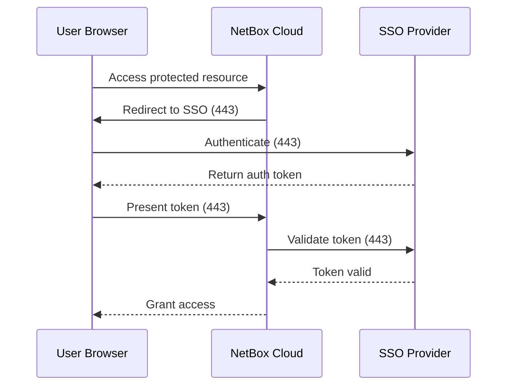
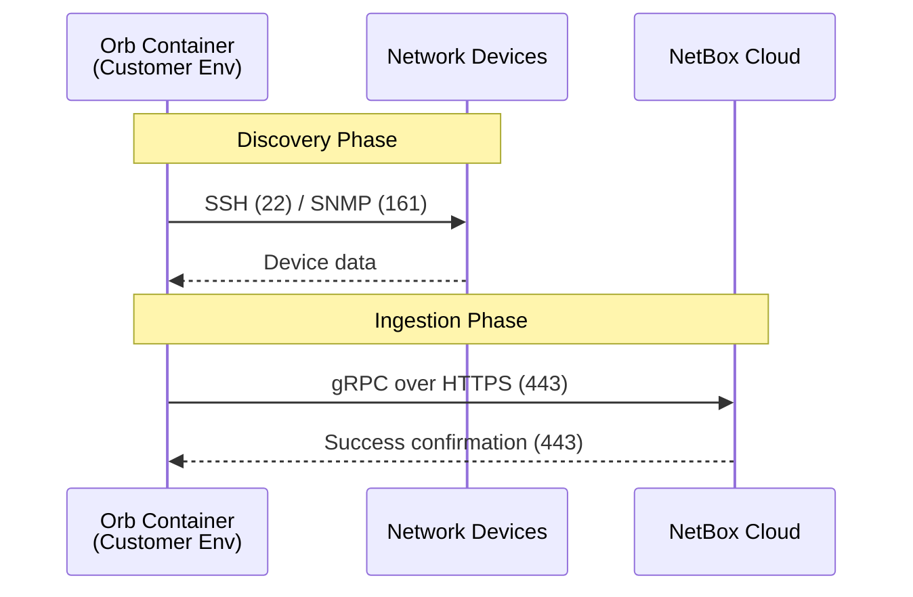

# Ports and Connectivity Architecture

This document provides information about NetBox Cloud connectivity, including required ports and network architecture for integrating your infrastructure with NetBox Cloud.

## Architecture Diagram



## Overview

NetBox Cloud provides secure HTTPS access for web browsers, APIs, and data ingestion services. This document outlines the connectivity requirements for:

- Web browser and API access
- SSO integration (Okta, EntraID, SAML)
- Data ingestion with Diode SDK
- Webhook delivery to external systems
- Network and device discovery from customer environments

## Required Outbound Ports from Customer Environment

The following outbound connectivity is required from your environment to access NetBox Cloud:

| Source | Destination | Port | Protocol | Purpose |
|--------|-------------|------|----------|---------|
| Web Browser | NetBox Cloud | 443 | HTTPS | Web UI and API access |
| Terminal/CLI | NetBox Cloud | 443 | HTTPS | API access, automation |
| Diode SDK | NetBox Cloud | 443 | gRPC/HTTPS | Data ingestion and synchronization |
| NetBox Cloud | Webhook Receivers | 443 | HTTPS | Outbound webhook delivery |
| NetBox Cloud | Webhook Receivers | 80 | HTTP | Outbound webhook delivery (if configured) |

## SSO Integration Ports

If you're using Single Sign-On integration:

| Source | Destination | Port | Protocol | Purpose |
|--------|-------------|------|----------|---------|
| Web Browser | Okta/EntraID/SAML Provider | 443 | HTTPS | Authentication redirect |
| NetBox Cloud | SSO Provider | 443 | HTTPS | SAML/OIDC validation |

## NetBox Cloud Access

NetBox Cloud provides secure access through standard HTTPS (port 443) for all customer interactions:

- **Web Access**: Browser-based UI access at `yourinstance.cloud.netboxapp.com`
- **API Access**: RESTful API for automation and integrations
- **Diode SDK**: Data ingestion via gRPC over HTTPS
- **High Availability**: Distributed architecture ensures reliable access
- **TLS Encryption**: All connections use TLS 1.2 or higher for security

## Detailed Connection Flows

### SSO Authentication Flow



### Diode SDK Data Ingestion Flow



## Discovery and Data Collection

When using NetBox Cloud with discovery and automation tools:

### Network Discovery Ports (Customer → Devices)

| Source | Destination | Port | Protocol | Purpose |
|--------|-------------|------|----------|---------|
| Orb Container | Network Devices | 22 | SSH | Device configuration collection (NAPALM - most common) |
| Orb Container | Network Devices | 830 | NETCONF | Device configuration collection (NAPALM - when supported) |
| Orb Container | Network Devices | Various | gNMI | Device configuration collection (NAPALM - when supported) |
| Orb Container | Network Devices | 161 | SNMP | SNMP discovery and monitoring |
| Orb Container | Network Devices | 443 | HTTPS | REST API access (Catalyst, Mist controllers) |

**Note**: NAPALM device discovery connections vary by driver and device capabilities. While SSH (port 22) is used for the majority of devices, some drivers may use NETCONF (port 830), gNMI, or other protocols depending on the target device and its configuration.

### Controller Integration Ports

| Source | Destination | Port | Protocol | Purpose |
|--------|-------------|------|----------|---------|
| Orb Container | VMware vCenter | 443 | HTTPS | Virtual infrastructure discovery |
| Orb Container | Network Controllers | 443 | HTTPS | SDN controller integration |

## Firewall and Security Configuration

### Required Firewall Rules

To use NetBox Cloud, configure your firewall to allow:

1. **Outbound HTTPS (Port 443)** from:
   - User workstations (for web browser access)
   - Automation servers (for API access)
   - Diode SDK servers (for data ingestion)

2. **Inbound HTTPS (Port 443)** from NetBox Cloud for:
   - Webhook delivery (optional - only if you use webhooks)
   - Configure allowlist using NetBox Cloud egress IPs (see [Public IP Addressing](../console-administration/public-ip-addressing))

3. **SSO Provider Access (Port 443)**:
   - Outbound HTTPS to your identity provider (Okta, EntraID, etc.)

### Network Security Considerations

- **TLS Encryption**: All NetBox Cloud connections use TLS 1.2 or higher
- **Certificate Validation**: Ensure your environment can validate standard TLS certificates
- **Proxy Support**: If using a corporate proxy, configure Diode SDK with proxy settings
- **IP Allowlisting**: Use [Prefix Lists](../console-administration/prefix-lists) to restrict access to NetBox Cloud

## Common Connectivity Scenarios

### Scenario 1: Basic Web Access Only

**Required Ports:**
- Outbound HTTPS (443) from user workstations to NetBox Cloud

**Use Case:** Users accessing NetBox Cloud web interface without automation

### Scenario 2: Web Access + SSO

**Required Ports:**
- Outbound HTTPS (443) from user workstations to NetBox Cloud
- Outbound HTTPS (443) from user workstations to SSO provider
- Outbound HTTPS (443) from NetBox Cloud to SSO provider (automatically configured)

**Use Case:** Organizations with Okta, EntraID, or SAML authentication

### Scenario 3: Web Access + Diode Data Ingestion

**Required Ports:**
- Outbound HTTPS (443) from user workstations to NetBox Cloud
- Outbound gRPC/HTTPS (443) from Diode SDK server to NetBox Cloud
- Outbound SSH (22) and SNMP (161) from Diode SDK server to network devices

**Use Case:** Automated network discovery and device data synchronization

### Scenario 4: Full Integration with Webhooks

**Required Ports:**
- Outbound HTTPS (443) from user workstations to NetBox Cloud
- Outbound gRPC/HTTPS (443) from Diode SDK server to NetBox Cloud
- Inbound HTTPS (443) from NetBox Cloud to webhook receivers
- Outbound SSH (22) and SNMP (161) from Diode SDK server to network devices

**Use Case:** Complete automation with event-driven workflows

## IP Address Requirements

NetBox Cloud uses dynamic IP addresses. For environments requiring IP allowlisting:

- **Inbound to Customer**: Use NetBox Cloud egress IP addresses for webhook allowlisting
  - See [Public IP Addressing](../console-administration/public-ip-addressing) for current egress IPs

- **Outbound from Customer**: NetBox Cloud hostnames resolve via DNS
  - Use DNS-based firewall rules when possible
  - Contact support for specific regional IP ranges if required

## DNS Requirements

Your environment must be able to resolve:

- **NetBox Cloud Instance**: `<your-instance>.cloud.netboxapp.com`
- **SSO Providers**: `*.okta.com`, `*.microsoftonline.com`, or your SAML provider domain

## Proxy Configuration

If your environment uses a corporate proxy:

### Browser Access
Configure your browser to allow NetBox Cloud URLs through the proxy.

### Diode SDK
Set environment variables on the Diode SDK server:
```bash
export HTTPS_PROXY=http://proxy.example.com:8080
export HTTP_PROXY=http://proxy.example.com:8080
export NO_PROXY=localhost,127.0.0.1,local.example.com
```

### Certificate Pinning
If your proxy performs SSL inspection, ensure it trusts the certificate authorities used by NetBox Cloud.

## Connectivity Testing

### Test Web Access
```bash
curl -I https://<your-instance>.cloud.netboxapp.com
```
Expected: HTTP 200 OK or redirect to login page

### Test Diode SDK Connectivity
```bash
# From your Diode SDK server
grpcurl -v <your-instance>.cloud.netboxapp.com:443 list
```
Expected: Service list or authentication error (confirms connectivity)

### Test Webhook Delivery
Configure a test webhook in NetBox Cloud pointing to a publicly accessible endpoint and verify delivery.

## Troubleshooting

### Cannot Access NetBox Cloud Web Interface

**Symptoms:** Timeout or connection refused

**Check:**
1. Verify outbound HTTPS (443) is allowed in firewall
2. Confirm DNS resolution: `nslookup <your-instance>.cloud.netboxapp.com`
3. Test connectivity: `curl -v https://<your-instance>.cloud.netboxapp.com`
4. Check proxy configuration if applicable
5. Verify [Prefix List](../console-administration/prefix-lists) settings allow your source IP

### Diode SDK Cannot Connect

**Symptoms:** gRPC connection failures

**Check:**
1. Verify outbound HTTPS (443) for gRPC is allowed
2. Confirm Diode SDK authentication token is valid
3. Check proxy environment variables if behind corporate proxy
4. Review Diode SDK logs for specific error messages
5. Test basic HTTPS connectivity to NetBox Cloud

### Webhooks Not Delivering

**Symptoms:** Events triggering but webhooks not received

**Check:**
1. Verify webhook receiver is accessible from Internet
2. Check webhook receiver firewall allows NetBox Cloud egress IPs
3. Confirm webhook URL uses HTTPS (recommended)
4. Review webhook logs in NetBox Cloud admin interface
5. Test webhook endpoint independently with curl

### SSO Authentication Failing

**Symptoms:** Redirect to SSO works but login fails

**Check:**
1. Verify SSO provider URL is accessible from Internet
2. Confirm NetBox Cloud is configured in SSO provider
3. Check SAML/OIDC settings match between provider and NetBox Cloud
4. Review SSO provider logs for error messages
5. Contact NetBox Labs support for SSO troubleshooting

## Security Best Practices

1. **Use Prefix Lists**: Restrict access to NetBox Cloud by source IP ranges
2. **Enable MFA**: Use multi-factor authentication on SSO provider
3. **Rotate API Tokens**: Regularly rotate Diode SDK and API tokens
4. **Monitor Access Logs**: Review access logs in NetBox Cloud console
5. **Webhook Security**: Use HTTPS and authentication for webhook endpoints
6. **Network Segmentation**: Run Diode SDK on dedicated management network
7. **Least Privilege**: Limit Diode SDK discovery scope to required devices only

## Related Documentation

- [Internet Delivery (Single Region)](./internet-delivery)
- [AWS Private Link](./aws-private-link)
- [IPSec VPN Tunnels](./ipsec-vpn-tunnels)
- [Prefix Lists Configuration](../console-administration/prefix-lists)
- [Public IP Addressing](../console-administration/public-ip-addressing)
- [Cloud Connectivity FAQ](./cloud-connectivity-faq)

## Support

For questions about NetBox Cloud connectivity or port requirements, please contact NetBox Labs support through the [Console](https://console.netboxlabs.com) or email support@netboxlabs.com.
