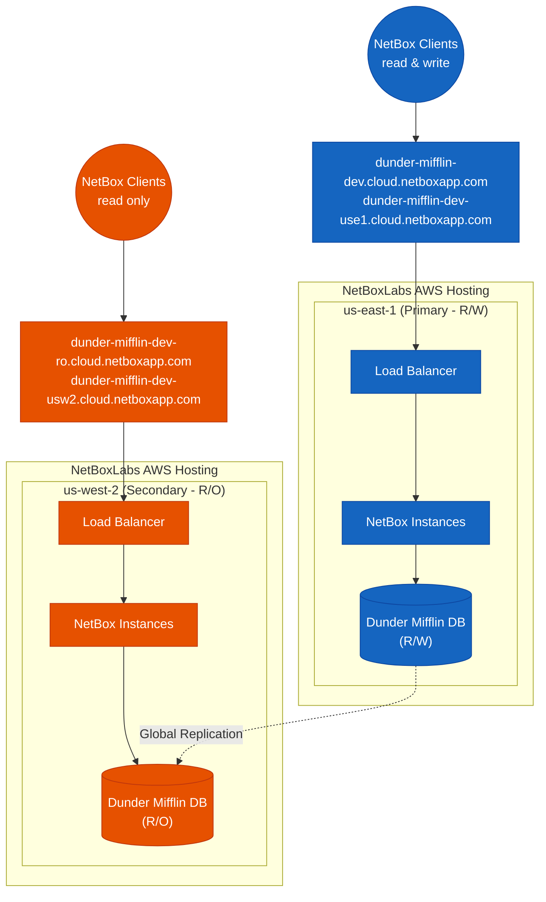

# Overview

NetBox Cloud includes multi-region deployment options as an add-on available to Premium Tier customers to improve availability and resilience. In this setup, your NetBox data is replicated across regions, allowing for a failover strategy in the event of a regional AWS outage.

This feature is typically recommended for customers with high availability requirements or global operations where downtime has significant impact.

## Prerequisites

- NetBox Cloud Premium Tier subscription

## Architecture

A multi-region deployment consists of:

- **Primary NetBox Instance**
  - Runs in your selected primary AWS region.
  - Provides full read/write access.
  - Has a unique hostname in the format `xxx.cloud.netboxapp.com`.

- **Secondary NetBox Instance**
  - Runs in a secondary AWS region.
  - Operates in read-only mode during normal operations.
  - Can be promoted to primary in a failover event.
  - Has a unique hostname in the format `xxx.cloud.netboxapp.com`.
  - Custom hostnames are not supported - both instances must use the standard `xxx.cloud.netboxapp.com` format.

- **Global Database Replication**
  - Uses AWS RDS PostgreSQL global replication.
  - Keeps database state synchronized between primary and secondary regions.

## Availability

Multi-region failover is available as an add-on for Premium Tier customers.

## When to Use Multi-Region Failover

This feature is best suited for customers who:

- Operate globally with strict uptime requirements.
- Require disaster recovery readiness.
- Need read-only access in multiple regions.

For customers with standard availability needs, a single-region deployment is often sufficient.

## Next Steps

If you are interested in enabling multi-region failover for your NetBox Cloud deployment:

1. **Contact your account team** to discuss requirements and availability
2. **Schedule implementation** with our deployment team

Our team will help scope requirements, estimate implementation timeline, and guide you through the setup process.
