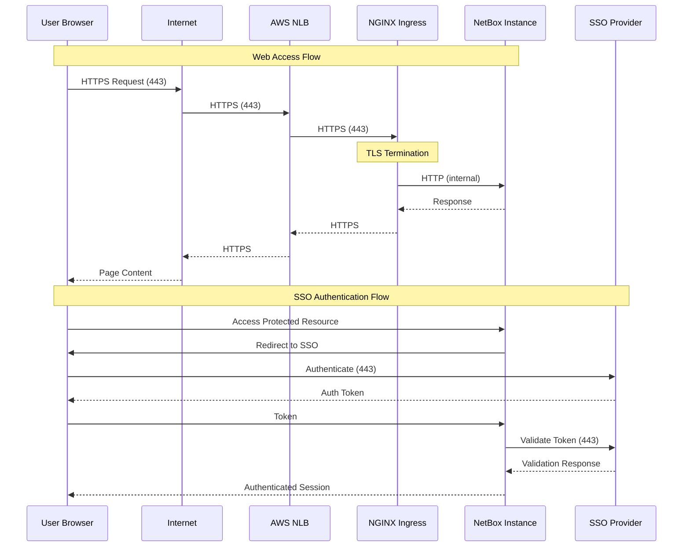
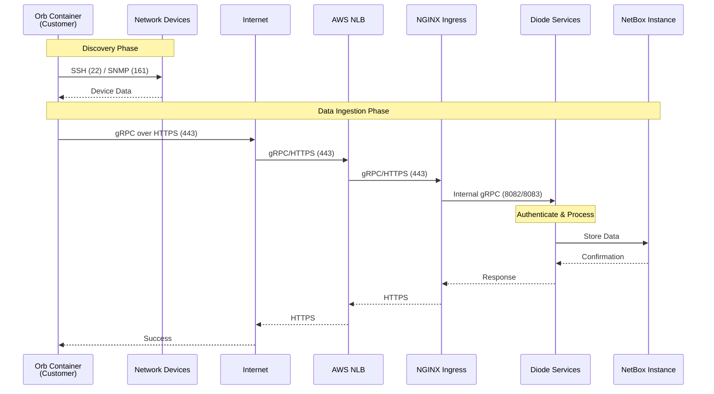
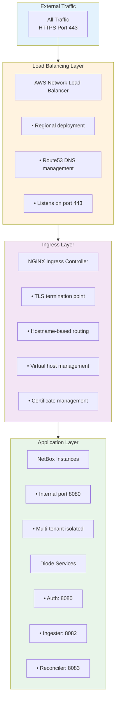
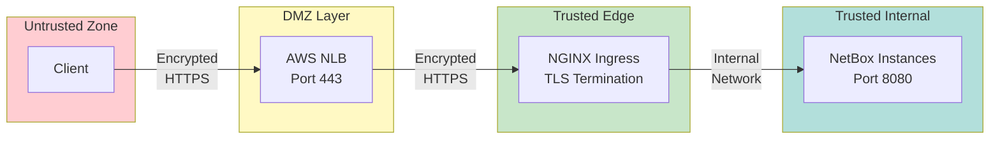

# NetBox Cloud Connectivity Architecture Diagram (Mermaid)

This is the accurate, 100% validated connectivity architecture diagram for NetBox Cloud.

## Full Architecture Diagram

```mermaid
graph LR
    subgraph Customer["Customer Environment"]
        User[("👤 User")]
        Browser["Web Browser"]
        Terminal["Terminal/CLI"]

        subgraph Discovery["Discovery & Data Collection"]
            Server["Server (VM or HW)"]
            subgraph Orb["Orb Container"]
                DiodeSDK["Diode SDK"]
                YAMLConfig["yaml config"]
                Nmap["nmap"]
                NAPALM["NAPALM"]
                SNMP["SNMP"]
                Workers["workers"]
                VCenter["vcenter"]
                Catalyst["catalyst"]
                Mist["mist"]
            end
        end

        subgraph Devices["Network Devices"]
            Router["Router"]
            Switch["Switch"]
            VCenterHost["vCenter"]
        end
    end

    Internet{{"Internet<br/>━━━━━━━━━━━━━━━"}}

    subgraph AWS["AWS Cloud"]
        NLB["AWS Network Load Balancer<br/>• Route53 DNS<br/>• Port 443<br/>• Regional"]

        NGINX["NGINX Ingress Controller<br/>• TLS Termination<br/>• Hostname Routing<br/>• Virtual Hosts"]

        subgraph NetBoxCloud["NetBox Cloud"]
            NetBoxInstance["Your NetBox Instance"]
        end

        subgraph DiodeServices["Diode Services<br/>(if enabled)"]
            DiodeAuth["Diode HTTP Auth"]
            DiodeIngester["Diode Ingester<br/>(gRPC)"]
            DiodeReconciler["Diode Reconciler<br/>(gRPC)"]
        end
    end

    subgraph External["External Services"]
        SSO["SSO Providers<br/>(Okta, EntraID, SAML)"]
        Webhook["Webhook Receiver<br/>(AAP, ITSM, etc.)"]
    end

    %% User to NetBox flows
    User --> Browser
    User --> Terminal
    Browser -->|"HTTPS (443)"| Internet
    Terminal -->|"HTTPS (443)"| Internet

    %% Orb Container to devices
    Orb -->|"SSH (22)"| Router
    Orb -->|"SSH (22)"| Switch
    Orb -->|"SNMP (161)"| Router
    Orb -->|"SNMP (161)"| Switch
    Orb -->|"HTTPS (443)"| VCenterHost

    %% Orb to NetBox
    Orb -->|"gRPC/HTTPS (443)"| Internet

    %% Internet to AWS Infrastructure
    Internet -->|"HTTPS (443)"| NLB
    NLB -->|"HTTPS (443)"| NGINX
    NGINX -->|"Internal Routing"| NetBoxInstance
    NGINX -->|"Internal Routing"| DiodeServices

    %% SSO flows (bidirectional)
    Browser <-->|"HTTPS (443)"| SSO
    NetBoxInstance -->|"HTTPS (443)<br/>SAML/OIDC Validation"| SSO

    %% Webhook delivery
    NetBoxInstance -->|"HTTPS (443)"| Internet
    Internet -->|"HTTPS (443)"| Webhook

    %% Styling
    classDef customerStyle fill:#CFE2F3,stroke:#333,stroke-width:2px
    classDef awsStyle fill:#FF9900,stroke:#333,stroke-width:2px,color:#000
    classDef netboxStyle fill:#4A90E2,stroke:#333,stroke-width:2px,color:#fff
    classDef infraStyle fill:#E8F4F8,stroke:#333,stroke-width:2px
    classDef externalStyle fill:#B8E6B8,stroke:#333,stroke-width:2px

    class Customer,Discovery,Devices,Orb customerStyle
    class AWS awsStyle
    class NetBoxCloud,NetBoxInstance netboxStyle
    class NLB,NGINX,DiodeServices infraStyle
    class SSO,Webhook externalStyle
```

## Simplified Flow Diagram

## Diode Data Ingestion Flow

## Infrastructure Layer Diagram

## Port Reference

| Port | Protocol | Direction | Purpose |
|------|----------|-----------|---------|
| 443 | HTTPS | Customer → NetBox Cloud | Web UI, API, gRPC |
| 443 | HTTPS | Browser ↔ SSO Provider | Authentication |
| 443 | HTTPS | NetBox Cloud → SSO | Validation |
| 443 | HTTPS | NetBox Cloud → Webhooks | Event delivery |
| 22 | SSH | Orb Container → Devices | Device config (NAPALM) |
| 161 | SNMP | Orb Container → Devices | Device discovery |
| 443 | HTTPS | Orb Container → vCenter | vSphere integration |

## Internal Ports (Not Customer-Facing)

| Port | Service | Purpose |
|------|---------|---------|
| 8080 | NetBox Instance | Internal application port |
| 8080 | Diode HTTP Auth | Internal authentication |
| 8082 | Diode Ingester | Internal gRPC service |
| 8083 | Diode Reconciler | Internal gRPC service |

**Note**: All internal ports are accessed externally via HTTPS (443) through the NLB and NGINX Ingress Controller.

## Architecture Layers Explained

### 1. Load Balancing Layer (AWS NLB)
- Entry point for all external traffic
- DNS resolution via Route53
- Regional deployment for high availability
- Port 443 listener for HTTPS traffic
- Distributes traffic to NGINX Ingress Controllers

### 2. Ingress Layer (NGINX Ingress Controller)
- **TLS Termination**: Decrypts HTTPS traffic
- **Hostname Routing**: Routes based on DNS hostname
- **Virtual Hosts**: Manages multiple customer instances
- **Path Routing**: Directs traffic to correct services
- **Certificate Management**: Handles SSL/TLS certificates

### 3. Application Layer (NetBox + Diode)
- NetBox instances running on internal port 8080
- Diode services for data ingestion (if enabled)
- Multi-tenant isolation via namespaces
- Internal service-to-service communication

## Key Architectural Decisions

1. **All External Traffic Uses Port 443**
   - Simplified firewall rules for customers
   - Industry standard HTTPS port
   - Supports both HTTP/2 (web) and gRPC

2. **TLS Terminates at NGINX Ingress**
   - Centralized certificate management
   - Enables hostname-based routing
   - Internal traffic can be HTTP (encrypted at network layer)

3. **Two-Tier Load Balancing**
   - AWS NLB for network-layer distribution
   - NGINX for application-layer routing
   - Provides both performance and flexibility

4. **Internal Ports Not Exposed**
   - Services use internal ports (8080, 8082, 8083)
   - Only accessible within AWS infrastructure
   - Customer only needs to know about port 443

## Security Architecture

## Usage in Documentation

This Mermaid diagram can be embedded in Docusaurus documentation and will render as an interactive, scalable diagram. It provides the same information as the PNG/SVG but with the advantage of being:

- ✅ Always accurate (maintained as code)
- ✅ Accessible and screen-reader friendly
- ✅ Scalable and responsive
- ✅ Easy to update (just edit the Mermaid code)
- ✅ Version controlled with documentation

To use in documentation, simply include the Mermaid code block in any markdown file.
