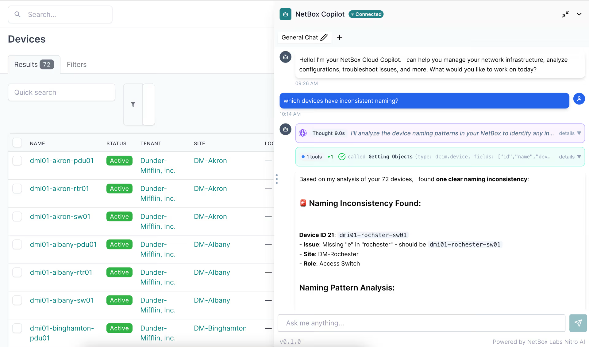

# NetBox Copilot

:::note
NetBox Copilot is currently in public preview. You may encounter bugs or inconsistencies. For questions or assistance, contact copilot-team@netboxlabs.com.
:::

## What is NetBox Copilot?

NetBox Copilot is an AI-powered assistant that embeds directly into your NetBox interface, providing a natural language way to interact with your network and infrastructure data. It works seamlessly with all NetBox editions - Community, Cloud, and Enterprise - without requiring any modifications to your NetBox installation.

Think of Copilot as your intelligent partner for working with NetBox. Instead of navigating through multiple pages or writing scripts to gather information, you can simply ask questions in plain language and get immediate answers.

## Key Benefits

**Accelerate Your Workflows**:
Get answers to complex questions in seconds instead of minutes. Copilot can query across multiple object types, analyze relationships, and surface insights faster than manual navigation.

**Democratize Network and Infrastructure Data**:
Make your NetBox data accessible to team members who may not be familiar with NetBox's structure or the NetBox API. Non-technical users can ask questions in their own words and get the information they need.

**Leverage AI with Your Data**:
Combine the power of large language models with deep knowledge of NetBox's data model and your specific infrastructure. Copilot understands both NetBox concepts and your actual data.

## Public Preview Status

NetBox Copilot is currently in **Public Preview**. This means:

- **Available to everyone**: Anyone can sign up and try Copilot with their NetBox instance
- **Free to use**: The free plan includes 1 million AI credits (equivalent to up to 1 million input tokens or 200,000 output tokens)
- **Actively developed**: We're continuously improving based on user feedback
-  **Read-only**: Write operations (creating, updating, deleting objects) are not yet available
-  **Early stage**: You may encounter rough edges and bugs - we value your feedback!

We're gathering feedback and refining the product before moving to general availability. Your input during this preview phase directly shapes the future of NetBox Copilot.

## What Can You Do with Copilot?

### Query Your NetBox Data
Ask questions about your infrastructure in natural language:
- "Show me all devices in the NYC datacenter"
- "What IP addresses are available in 10.0.1.0/24?"
- "Which interfaces on switch01 are not connected?"

### Analyze Relationships
Explore connections across your network infrastructure:
- "Show me all devices in racks that are over 80% full"
- "What VLANs are used in the datacenter site?"
- "Which devices in the production environment are missing primary IPs?"

### Investigate Changes
Track what happened and when:
- "What changes were made to this device last week?"
- "Show me the change history for device 123"
- "Who modified this IP address?"

### Get Help with NetBox
Access NetBox documentation and learn as you work:
- "How do VRFs work in NetBox?"
- "What's the difference between a site and a location? Should I be using both?"
- "How do I use cable traces?"

## Getting Started

Ready to try NetBox Copilot? Getting started takes just a few minutes:

1. **Enable Copilot** in your NetBox instance (just a simple console script - no installation required)
2. **Create an account** or log in through the Copilot interface
3. **Start asking questions** about your NetBox data

[Check out the Quickstart Guide](quickstart.md) for step-by-step instructions.

## Need Help?

- **Questions or feedback?** Contact us at copilot-team@netboxlabs.com or use the feedback button in the Copilot interface
- **Want to learn more?** Check out the [Usage Guide](usage-guide.md) for detailed capabilities and best practices
- **Privacy concerns?** See our [Privacy & Security](privacy-security.md) page for complete details on data handling
