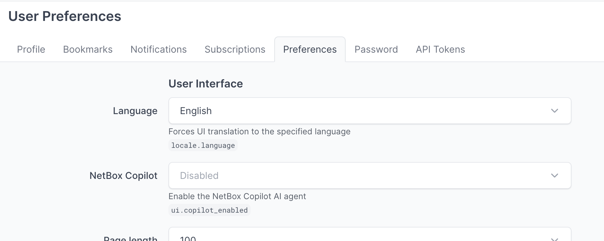
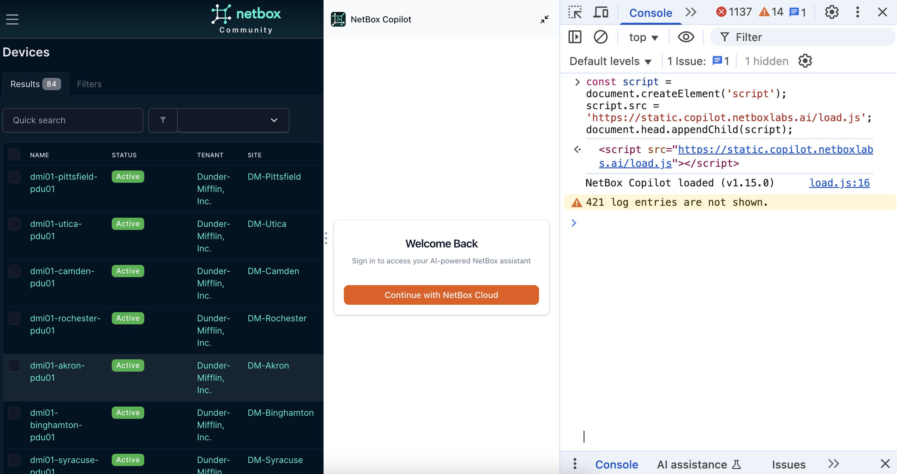
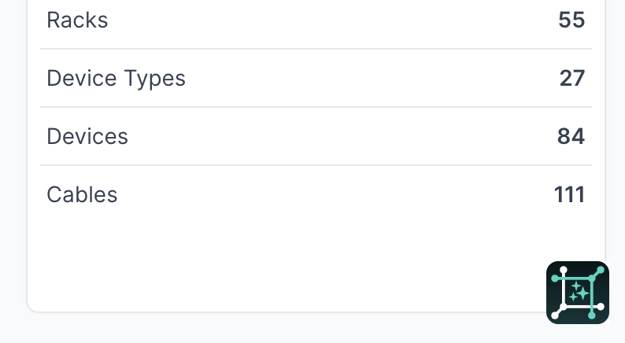
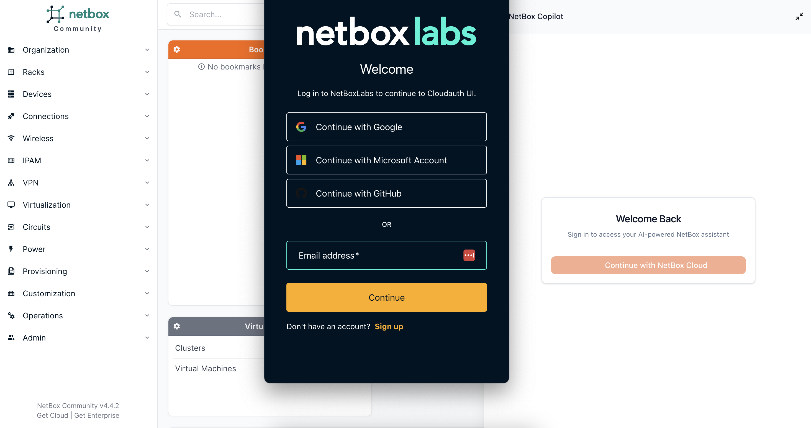
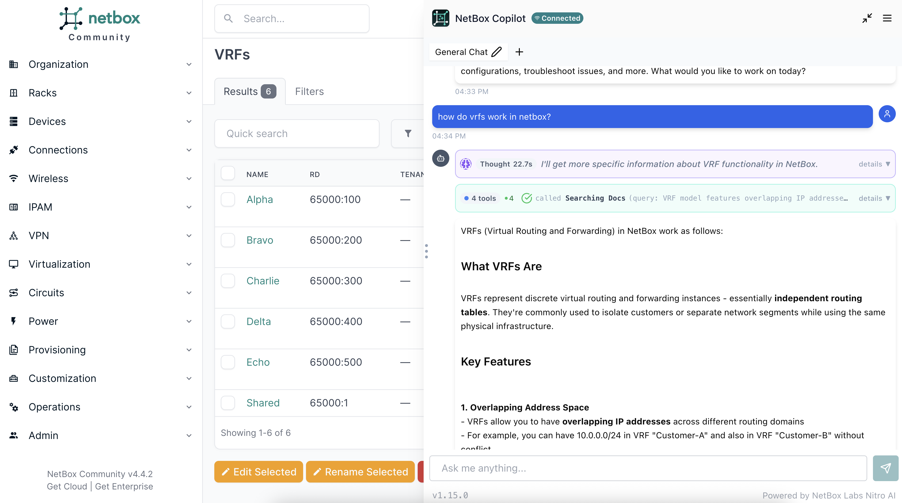

# NetBox Copilot Quickstart Guide

:::note
NetBox Copilot is currently in public preview. You may encounter bugs or inconsistencies. For questions or assistance, contact copilot-team@netboxlabs.com.
:::


Get NetBox Copilot up and running in your NetBox instance in just a few minutes.

## Prerequisites

Before you begin, make sure you have:

- **NetBox 4.2.x or higher** (strongly recommended for best compatibility)
- **A modern web browser**: Chrome/Edge 90+, Firefox 88+, or Safari 14+

## Installation Options

Choose the installation method that best fits your needs:

### Option 1: Native Preference (NetBox 4.4.5+)

**Recommended for:**
- Users with NetBox 4.4.5 or later
- All NetBox editions (Community, Cloud, Enterprise)
- Permanent installation with easy toggle on/off

NetBox 4.4.5 introduced native Copilot integration. Simply enable it in your user preferences:

**Steps:**

1. Log into your NetBox instance
2. Click your username in the top-right corner
3. Select **Preferences** from the dropdown
4. Navigate to the **Preferences** tab
5. Find the **NetBox Copilot** setting and select **Enabled** from the dropdown
6. Scroll down and click **Update** to save your preferences
7. Refresh your NetBox page



Copilot should appear in the bottom-right corner of your NetBox interface within a few seconds.

**Note:** If you don't see the NetBox Copilot preference option:
- Verify you're running NetBox 4.4.5 or later (check the footer of your NetBox page)
- Check with your NetBox administrator - they may have disabled Copilot globally for your instance

**Note:** If you have firewall restrictions, ensure `*.copilot.netboxlabs.ai` is allowed as the application uses multiple domains in that scope.

### Option 2: Console-Based Installation (Temporary)

**Recommended for:**
- NetBox versions prior to 4.4.5
- Quick evaluation and testing
- Trying before permanently installing

This method temporarily adds Copilot to your current browser session. You'll need to re-run the script after a page refresh or closing your browser. The script persists during normal NetBox navigation.

**Steps:**

1. Open your NetBox instance in your web browser
2. Open the browser developer console:
   - **Windows/Linux**: Press `F12` or right-click anywhere and select "Inspect" → "Console"
   - **Mac**: Press `Cmd+Option+I` or right-click and select "Inspect Element" → "Console"

3. Copy and paste the following code into the console and press Enter:

```javascript
const script = document.createElement('script');
script.src = 'https://static.copilot.netboxlabs.ai/load.js';
document.head.appendChild(script);
```

4. Copilot should appear in the bottom-right corner of your NetBox interface within a few seconds

**Note:** If you have firewall restrictions, ensure `*.copilot.netboxlabs.ai` is allowed as the application uses multiple domains in that scope.



**Note:** At general availability, we will provide integrated installation options for NetBox Cloud and NetBox Enterprise customers.

### Option 3: Template Edit (Persistent)

**Recommended for:**
- NetBox versions prior to 4.4.5
- Users who want permanent installation without using the native preference

This method adds Copilot to your NetBox installation configuration, making it available every time you access NetBox.

**Steps:**

Add this script tag before the closing `</body>` tag in your custom `base.html` template:

```html

  <script src="https://static.copilot.netboxlabs.ai/load.js" defer></script>

```

**After making changes:**
- Restart your NetBox service (command varies by setup)
- Clear your browser cache
- Reload your NetBox page

**Note:** This method is retained for users who prefer template-based installation or are running NetBox versions prior to 4.4.5.

## Verify Installation

After following any of the installation methods:

1. Look for the Copilot interface in the **bottom-right corner** of your NetBox page
2. You should see a chat icon or Copilot panel
3. If nothing appears, check the browser console (F12) for any error messages



**Troubleshooting:**
- **Copilot doesn't appear**: Verify network access to `*.copilot.netboxlabs.ai` and check browser console for errors
- **CORS errors in console**: Check if your network has proxy or firewall restrictions (ensure `*.copilot.netboxlabs.ai` is allowed)
- **Script loads but no interface**: Try refreshing the page or clearing browser cache

## Create Your Account

The first time you open Copilot:

1. Click the Copilot interface in the bottom-right corner
2. You'll see a sign-up or login screen for NetBox Cloud
3. **New users**: Choose an authentication mechanism (SSO or email) and sign up for a NetBox Cloud account
4. **Existing users**: Log in with your existing credentials

**Free Plan includes:**
- 1 million AI credits (equivalent to up to 1 million input tokens or 200,000 output tokens)
- This should be enough for substantial usage and multiple extended conversations



## Your First Conversation

Once logged in, you're ready to start using Copilot!


**Try these example queries:**

1. **Find devices**: "Show me all devices in [your site name]"
2. **Check IPs**: "What IP addresses are available in 10.0.1.0/24?"
3. **Inspect interfaces**: "Which interfaces on [device name] are not connected?"
4. **Review changes**: "What changes were made to this device?" (when viewing a device page)
5. **Get help**: "How do VRFs work in NetBox?"



**Understanding Responses:**

Copilot will:
- Answer in natural language
- Show you how it gathered the information (thinking and tool usage traces)
- Maintain context across your conversation

**Tips:**
- Copilot knows what page you're on - you can say "this device" or "this site"
- Follow up with additional questions to drill deeper
- Ask Copilot to explain if something isn't clear

## What's Next?

Now that you have Copilot running, explore what it can do:

- **[Usage Guide](usage-guide.md)** - Learn about all of Copilot's capabilities and best practices
- **[Privacy & Security](privacy-security.md)** - Understand how your data is handled
- **[FAQ](usage-guide.md#frequently-asked-questions)** - Get answers to common questions

## Getting Help

**Need assistance?**
- Email: copilot-team@netboxlabs.com
- Use the feedback button within Copilot
- Include browser console errors when reporting issues

**Have feedback?**
We're actively improving Copilot during Public Preview. Your feedback helps us make it better!
