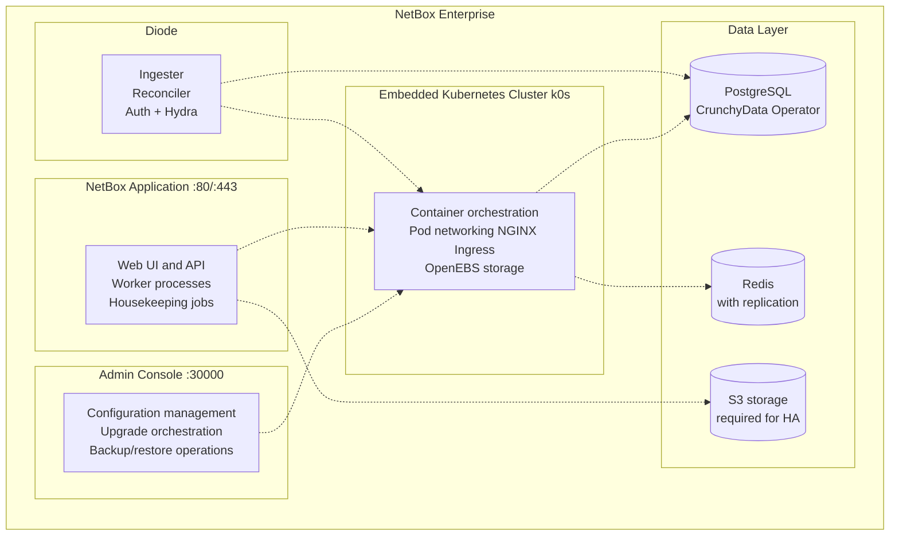

# NetBox Enterprise Overview

## Overview

NetBox Enterprise is a self-hosted NetBox distribution built by NetBox Labs for organizations deploying NetBox in their own infrastructure. It provides a streamlined installation and upgrade experience through an embedded Kubernetes cluster, along with enterprise-grade features and professional support.

**Key Benefits:**

- **Simplified Deployment**: Fully managed installer handles Kubernetes cluster setup and NetBox deployment
- **Enterprise Features**: Advanced capabilities including SSO authentication, LDAP/SAML integration, plugin management, and backup/restore
- **Professional Support**: Access to NetBox Labs engineering team for technical assistance
- **Flexible Architecture**: Use embedded components or integrate with external PostgreSQL, Redis, and S3-compatible storage
- **Automated Updates**: Simplified upgrade process through admin console
- **Production Ready**: Battle-tested deployment architecture used by enterprise customers

**Key Concepts:**

- **Embedded Cluster**: Self-contained Kubernetes cluster (k0s distribution) deployed and managed by the installer
- **Admin Console**: Web-based management interface (KOTS) for configuration and upgrades on port 30000
- **Diode**: Data ingestion service for automated network discovery and reconciliation
- **Embedded Components**: Bundled PostgreSQL (CrunchyData operator), Redis, and OpenEBS storage
- **External Integration**: Connect to external PostgreSQL, Redis, and S3-compatible storage
- **Replicas**: Multiple NetBox and worker instances for load distribution (limits based on license tier)

## Architecture

NetBox Enterprise uses an embedded Kubernetes cluster architecture that provides production-grade infrastructure with minimal configuration:

### Component Options

NetBox Enterprise provides flexibility in choosing between embedded and external components:

| Component | Embedded Option | External Option | When to Use External |
|-----------|----------------|-----------------|----------------------|
| **PostgreSQL** | CrunchyData Postgres Operator | AWS RDS, Cloud SQL, managed PostgreSQL | Existing managed databases (requires 3 databases: netbox, diode, hydra) |
| **Redis** | Bitnami Redis with replication | AWS ElastiCache, managed Redis | Existing managed caching infrastructure |
| **Object Storage** | Local persistent volume | AWS S3, MinIO, DigitalOcean Spaces | **Required for multi-node/HA deployments** |
| **Kubernetes** | Embedded k0s cluster | N/A | Embedded cluster required |

## Deployment Scenarios

### Production Deployment

Recommended for production NetBox Enterprise deployments:

- **Use Case**: Production NetBox instance
- **Resources**: 8 vCPU, 24 GB RAM, 100 GB SSD
- **Components**: Embedded PostgreSQL and Redis, or external managed services
- **Replicas**: 2 or more NetBox application replicas
- **Backup**: Regular database backups configured

### Development and Testing

Recommended for non-production environments:

- **Use Case**: Development, staging, or testing
- **Resources**: 4 vCPU, 16 GB RAM, 50 GB SSD
- **Components**: All embedded components
- **Replicas**: 1 NetBox replica
- **Backup**: Optional

## Getting Started

To deploy NetBox Enterprise, follow this process:

1. **Review Requirements**: Check [system requirements](nbe-ec-requirements.md) for your distribution
   - [Ubuntu requirements](nbe-ec-requirements-ubuntu.md)
   - [RHEL requirements](nbe-ec-requirements-rhel.md)
   - [Linux system changes](nbe-ec-linux-changes.md)

2. **Prepare Your Host**: Configure firewall, disable swap, load kernel modules

3. **Install NetBox Enterprise**: Follow the [installation guide](nbe-ec-installation.md)

4. **Configure NetBox**: Use Admin Console to configure superuser, replicas, database, and authentication

5. **Deploy and Verify**: Deploy NetBox and verify access on ports 80/443

6. **Migrate Data** (Optional): Import existing NetBox data using the [migration guide](nbe-migrating.md)

7. **Configure Plugins** (Optional):
   - Enable [built-in plugins](nbe-ec-built-in-plugins.md)
   - Install [custom plugins](nbe-ec-custom-plugins.md)

8. **Configure Authentication** (Optional):
   - [SAML SSO](nbe-saml.md)
   - [Azure AD SSO](nbe-azure-sso.md)
   - [OIDC SSO](nbe-oidc-sso.md)
   - [LDAP](nbe-ldap.md)

## Support and Documentation

- **Installation Issues**: See [troubleshooting guide](nbe-troubleshooting.md)
- **Technical Support**: Contact your NetBox Enterprise support representative
- **Release Information**: Review [release notes](nbe-release-notes.md) before upgrading
- **Backup and Recovery**: Configure [database backups](nbe-backups.md)
