---
tags:
  - assurance
  - automation
  - cloud
  - discovery
  - enterprise
  - getting-started
  - integration
  - netbox
title: Getting Started with the Juniper Mist Integration for NetBox
source: localdocs
lastUpdatedAt: 1765379831000
canonical: /docs/integrations/platform-integrations/juniper-mist/getting-started/
---

This guide will help you set up and start using the Juniper Mist Integration for NetBox.

- [Prerequisites](#prerequisites)
- [Host Requirements](#host-requirements)
  - [System](#system)
  - [Network](#network)
- [NetBox Setup](#netbox-setup)
  - [Generate Diode Client Credentials](#generate-diode-client-credentials)
- [Agent Setup and Configuration](#agent-setup-and-configuration)
  - [Step 1: Authenticate to the NetBox Labs Image Registry](#step-1-authenticate-to-the-netbox-labs-image-registry)
  - [Step 2: Configure the Agent](#step-2-configure-the-agent)
  - [Scope Configuration](#scope-configuration)
  - [Bootstrap Mode (First-Time Setup)](#bootstrap-mode-first-time-setup)
  - [Optional - Dry Run Mode](#optional---dry-run-mode)
  - [Step 3: Run the Agent](#step-3-run-the-agent)
    - [Method 1: Set Environment Variables Manually](#method-1-set-environment-variables-manually)
    - [Method 2: Use a `.env` File (Recommended)](#method-2-use-a-env-file-recommended)
  - [Expected Output](#expected-output)
- [View and Apply Discovered Data in NetBox Assurance](#view-and-apply-discovered-data-in-netbox-assurance)
  - [Accessing NetBox Assurance](#accessing-netbox-assurance)
  - [Explore Deviation Types](#explore-deviation-types)
  - [View Active Deviations](#view-active-deviations)
  - [Apply Deviations](#apply-deviations)
- [View the Juniper Mist Data in NetBox](#view-the-juniper-mist-data-in-netbox)
- [Additional Resources](#additional-resources)
  - [Related Documentation](#related-documentation)
  - [Support](#support)

---

## Prerequisites

Before you begin, ensure you have the following:

- **NetBox Cloud** or **NetBox Enterprise** with **NetBox Assurance** 
- **Orb Agent Pro** credentials (required to download the integration agent image)
- **Juniper Mist Platform** with API access
- **Host System** with Docker support
- **Network connectivity** between your host(s) and both NetBox instance and the Juniper Mist Platform

## Host Requirements

### System
- **Operating System**: Linux, macOS, or Windows with Docker support
- **Memory**: Minimum 2GB RAM (4GB recommended)
- **Storage**: 1GB free disk space
- **Network**: Stable internet connection for pulling Docker images
- **Docker**: Version 20.10 or later

### Network
- **Outbound gRPC/gRPCS** access to Diode on your NetBox instance (typically port 443 for gRPCS)
- **Outbound HTTP/HTTPS** access to your Juniper Mist Platform (typically port 443 for HTTPS)
- **DNS resolution** for both NetBox and Juniper Mist Platform hostnames
- **Firewall rules** configured to allow the above connections from your agent host

---
## NetBox Setup

### Generate Diode Client Credentials
1. Log into your NetBox instance
2. Navigate to **Diode → Client Credentials**
3. Click **+ Add a Credential**
4. Enter a descriptive name (e.g., "Mist Integration")
5. Click **Create**
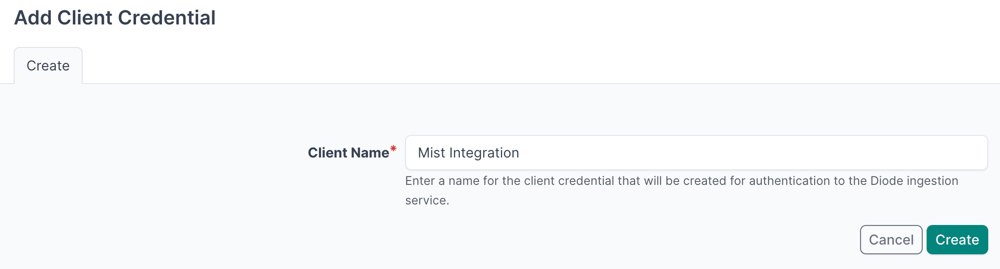
6. **Important**: Copy and securely store the Client ID and Client Secret as you will reference this in the agent configuration file in later steps
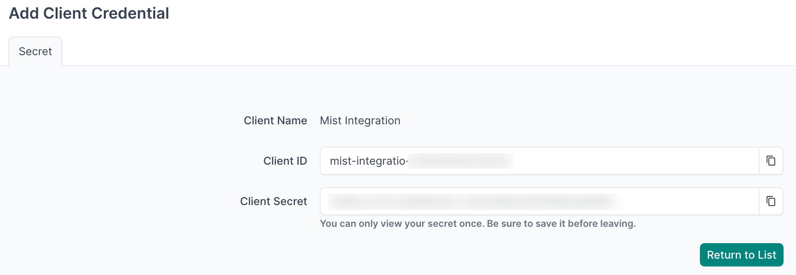
7. Navigate to **Diode → Settings**
8. Copy the value of the **Diode target** as you will reference this in the agent configuration file in later steps
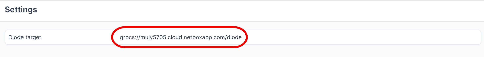

---

## Agent Setup and Configuration

:::info
If you have multiple Organisations in the Mist platform, you can deploy multiple agents configured to sync data for each Organisation. Each one will be mapped to a separate Tenant in NetBox.

:::
### Step 1: Authenticate to the NetBox Labs Image Registry

From your host machine, authenticate to the NetBox Labs registry, using the `CUSTOMER-IDENTIFIER` and `Token` that you have been provided by the NetBox Labs team:

```bash
docker login -u<CUSTOMER-IDENTIFIER> netboxlabs.jfrog.io
```

**Example session**
```bash
% docker login -u<customer-abc123> netboxlabs.jfrog.io # note there are no spaces after -u
# Use the Token provided as the password when prompted
Password:
Login Succeeded
```

### Step 2: Configure the Agent

1. **Create the configuration file** (you can name the file anything you like):

```bash
touch agent.yaml
```

2. **Edit the configuration file** with your preferred editor and add the following configuration. **Important**: Replace `grpcs://your-instance.netboxcloud.com/diode` with the value from **Diode > Settings > Diode target** in the NetBox UI:

```yaml
orb:
  config_manager:
    active: local
  backends:
    worker:
    common:
      diode:
        target: grpcs://your-instance.netboxcloud.com/diode # Get this value from Diode > Settings > Diode target
        client_id: ${DIODE_CLIENT_ID}
        client_secret: ${DIODE_CLIENT_SECRET}
        agent_name: juniper_mist_agent  # Use a meaningful name to identify this agent
  policies:
    worker:
      juniper_mist_worker:
        config:
          package: nbl_juniper_mist
          schedule: "0 2 * * *" # Daily at 2:00 AM. Set your desired schedule (see examples below)
          MIST_APITOKEN: ${MIST_APITOKEN}
          MIST_ORG_ID: ${MIST_ORG_ID}
          BOOTSTRAP: True  # Set to True for initial setup, False for regular operation
        scope:
          sites: ["BLN7"]  # Optional: Limit sync to specific sites (see scope configuration below)
```

:::info[Schedule Examples]
The `schedule` field uses cron syntax. Here are some common examples:

- `"0 */6 * * *"` - Every 6 hours (e.g., 00:00, 06:00, 12:00, 18:00)
- `"0 2 * * *"` - Daily at 2:00 AM
- `"0 9 * * 1"` - Weekly on Monday at 9:00 AM

:::
### Scope Configuration

The `scope` section allows you to limit the data synchronization to specific sites, reducing the amount of data processed and improving performance.

**Configuration Options:**
- `["*"]` or omitted: Syncs all sites (default)
- `["Site-A", "Site-B"]`: Syncs only specified sites and their devices
  - Devices from filtered sites are excluded from synchronization
  - Devices without site assignment are always included (assigned to "Default Site")
  - Invalid site names raise an error with available site list

**Example:**
```yaml
scope:
  sites: ["BLN7", "NYC1"]  # Only sync these specific sites
```

### Bootstrap Mode (First-Time Setup)

Bootstrap mode is used for the **initial setup only** of the integration. When enabled, it creates static content in NetBox that the integration requires to function properly.

**What Bootstrap Mode Does:**
- Creates required Manufacturers
- Creates necessary Tags
- Creates required Custom Fields
- Sets up initial data structures

**Configuration:**
```yaml
config:
  BOOTSTRAP: True  # Set to True for initial setup, False for regular operation
```

**First-Time Run Process:**
1. **Run the agent** with `BOOTSTRAP: True` in your configuration
2. **Monitor the output** for the text `executed successfully`
3. **Stop the agent immediately** by pressing `Ctrl+C` in your terminal once you see `executed successfully`
4. **Apply the deviations** in NetBox Assurance (see [Apply Deviations](#apply-deviations) section below)
5. **Set `BOOTSTRAP: False`** for all future runs

**Important Notes:**
- Bootstrap mode is **only for first-time setup** - do not run it on a schedule
- You must stop the agent manually with `Ctrl+C` after seeing `executed successfully`
- After bootstrap, you'll see deviations for Custom Fields, Manufacturers, etc. that must be applied
- Once deviations are applied, set `BOOTSTRAP: False` for regular operation

### Optional - Dry Run Mode

The agent can be run in **Dry Run** mode, which means discovered data is written to a `json` formatted file instead of to NetBox. This can be useful for troubleshooting - for example you could share the file with the NetBox Labs support team to investigate issues ingesting certain data. 

Enable this in the `Diode` section of your agent configuration file, by adding the `dry_run` key and setting the value to `true` (it is `false` by default) and set the `dry_run_output_dir` value to the location you want the file to be saved.

```yaml
      diode:
        dry_run: true
        dry_run_output_dir: /opt/orb/ # this will save the output file into the same directory that you run the agent from
```

### Step 3: Run the Agent
Run the agent to synchronize data Juniper Mist into NetBox:

#### Method 1: Set Environment Variables Manually

1. **Export Diode credentials** as environment variables:
```bash
export DIODE_CLIENT_ID="your-client-id"
export DIODE_CLIENT_SECRET="your-client-secret"
```

2. **Export Mist credentials** as environment variables:
```bash
export MIST_APITOKEN="your-mist-api-token"
export MIST_ORG_ID="your-mist-organisation-id"
```

3. **Run the agent** with the following command:
```bash
docker run \
  -v $PWD:/opt/orb/ \
  -e DIODE_CLIENT_SECRET \
  -e DIODE_CLIENT_ID \
  -e MIST_APITOKEN \
  -e MIST_ORG_ID \
  netboxlabs.jfrog.io/obs-orb-agent-pro/orb-agent-pro \
  run -c /opt/orb/agent.yaml
```

#### Method 2: Use a `.env` File (Recommended)

1. **Create a `.env` file** in your current directory:
```bash
touch .env
```

2. **Edit the `.env` file** with your preferred editor and add the following content:
```bash
# NetBox Diode credentials (from Step 1)
DIODE_CLIENT_ID=your-client-id
DIODE_CLIENT_SECRET=your-client-secret

# Juniper Mist credentials
MIST_APITOKEN=your-mist-api-token
MIST_ORG_ID=your-mist-organisation-id
```

:::warning[Important]
Replace the placeholder values with your actual credentials:
- `your-client-id` and `your-client-secret` from the NetBox Diode setup
- `your-mist-api-token` and `your-mist-organisation-id` with your Juniper Mist credentials

:::
1. **Run the agent** with the following command:
```bash
docker run \
  -v $PWD:/opt/orb/ \
  --env-file .env \
  netboxlabs.jfrog.io/obs-orb-agent-pro/orb-agent-pro \
  run -c /opt/orb/agent.yaml
```

:::tip[Security Best Practice]
When using Method 2, add `.env` to your `.gitignore` file to prevent accidentally committing sensitive credentials to version control:
```bash
echo ".env" >> .gitignore
```

:::
### Expected Output

After you issue the command to run the agent, depending on the `schedule` you defined in the configuration file, you should see similar to the output below: 

```
...
{"time":"2025-09-03T09:38:05.108085923Z","level":"INFO","msg":"worker stderr","log":"INFO:mistapi:apiresponse:__init__:response status code: 200"}
{"time":"2025-09-03T09:38:05.108185756Z","level":"INFO","msg":"worker stderr","log":"DEBUG:mistapi:apiresponse:_check_next"}
{"time":"2025-09-03T09:38:05.108242173Z","level":"INFO","msg":"worker stderr","log":"DEBUG:mistapi:apiresponse:__init__:HTTP response processed"}
{"time":"2025-09-03T09:38:05.10869184Z","level":"INFO","msg":"worker stderr","log":"INFO:nbl_juniper_mist.mist_diode:auth_type='psk', checking pairwise ciphers to determine auth_cipher."}
{"time":"2025-09-03T09:38:05.108724756Z","level":"INFO","msg":"worker stderr","log":"WARNING:nbl_juniper_mist.mist_diode:No recognized pairwise cipher found for pairwise=[], defaulting to None."}
{"time":"2025-09-03T09:38:05.108916131Z","level":"INFO","msg":"worker stderr","log":"INFO:nbl_juniper_mist.mist_diode:Enriching devices with WirelessLAN references using API data correlation."}
{"time":"2025-09-03T09:38:05.388067048Z","level":"INFO","msg":"worker stderr","log":"INFO:worker.policy.runner:Policy juniper_mist_worker: Successful ingestion"}
{"time":"2025-09-03T09:38:05.389607673Z","level":"INFO","msg":"worker stderr","log":"INFO:apscheduler.executors.default:Job \"PolicyRunner.run (trigger: date[2025-09-03 09:37:59 UTC], next run at: 2025-09-03 09:37:59 UTC)\" executed successfully"}
```
:::tip[Monitoring and Testing]
**Success Indicators**: Look for the text `Successful ingestion` in the output, which confirms that data was successfully sent to your NetBox instance via Diode.

**Testing Mode**: For testing purposes, you can run the agent once and then stop it:
- Press `Ctrl+C` in your terminal to stop the agent
- This is useful for verifying configuration before setting up continuous operation

**Continuous Operation**: The agent will continue running according to your schedule until manually stopped or the container is terminated.


:::
## View and Apply Discovered Data in NetBox Assurance

You can now work with the Mist data that has been discovered by the agent in the NetBox Assurance UI. 

**NetBox Assurance** gives you control over operational drift by identifying **deviations** between your operational state and NetBox, and analytics to understand drift and plan for remediation, and ultimately take action. 

:::tip[Understanding Deviations]
**Deviations** are the delta between the data already in NetBox as the Network Source of Truth, versus the actual operational state of the network as discovered by the controller integration. 

From an initial run of the integration it could be that ALL discovered data is a **deviation** as it may not have existed in NetBox previously. Once the initial sync of data has taken place, and NetBox has been updated, then further integration runs would result in new deviations only.

:::
### Accessing NetBox Assurance
1. Navigate to the UI of NetBox instance
2. Click on **Assurance** in the main navigation menu

### Explore Deviation Types
1. Click on **Deviation Types** to view the types of deviations that have been discovered
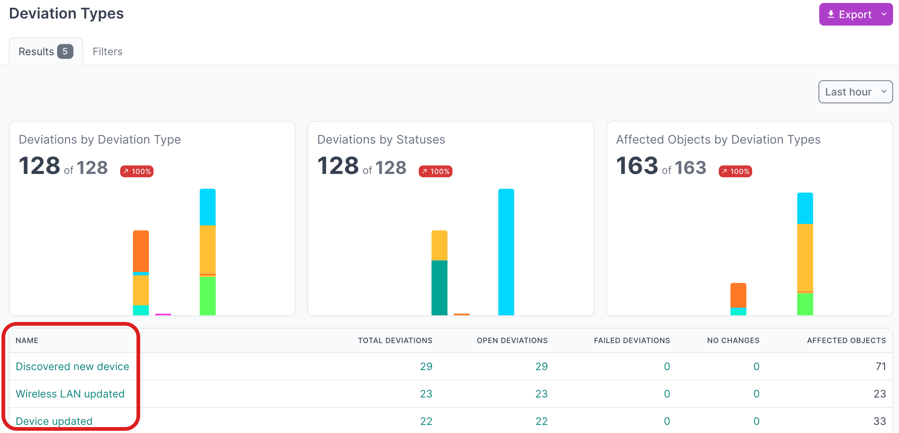
2. Click on the **Name** of a deviation type, to view deviations for a particular type
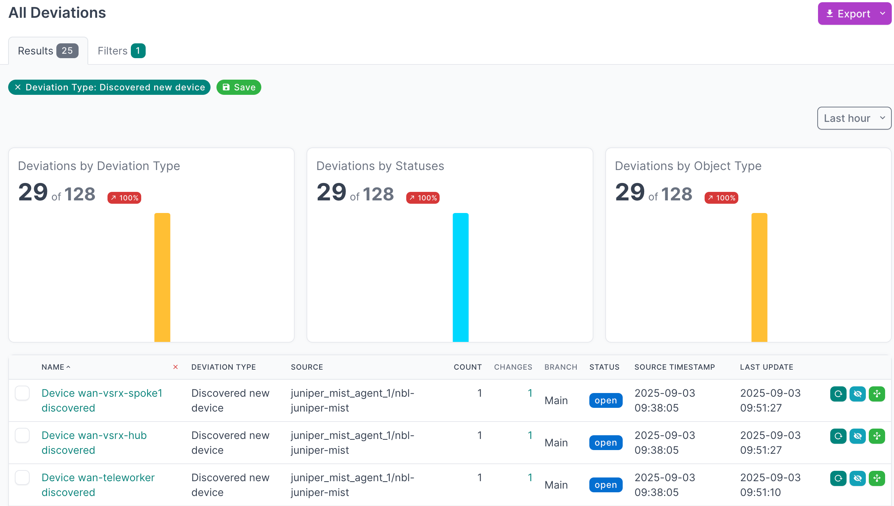
3. Click on the **Name** of an individual deviation, to view the details
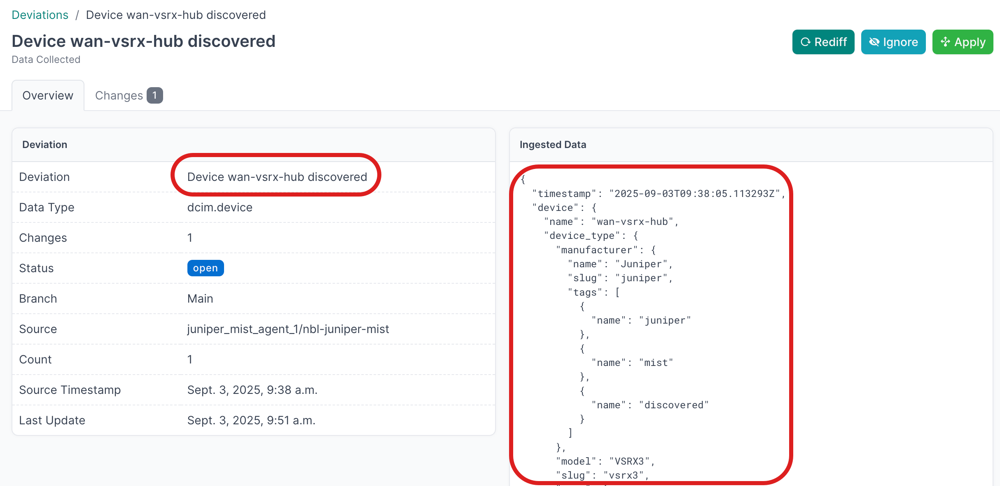

### View Active Deviations
1. Click on **Active Deviations** to view all the deviations that have not yet been **Applied** or **Ignored**
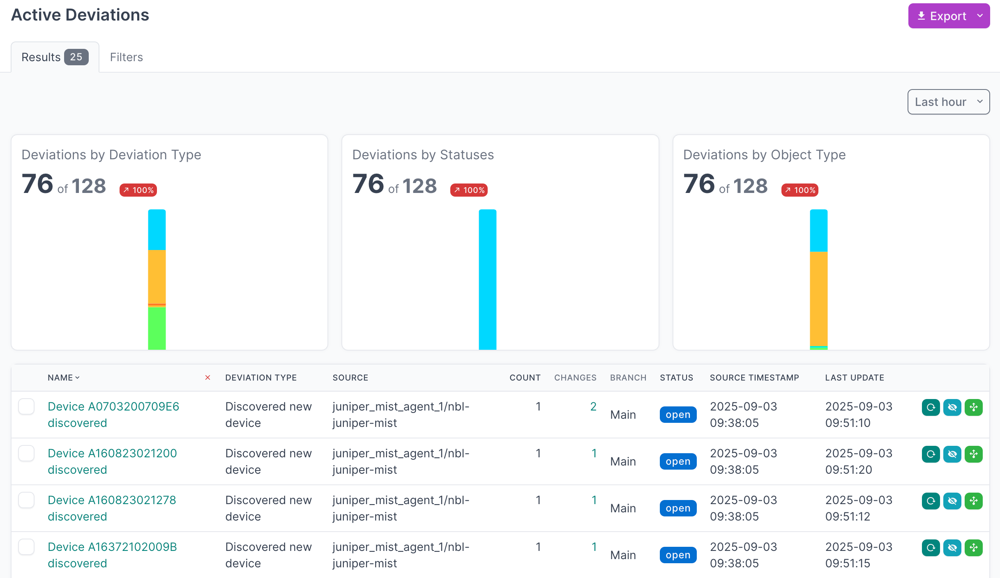
2. Click on the **Name** of a deviation, to view the details

### Apply Deviations
1. Select all the deviations that you'd like to apply. If you are working with a large number of deviations, first set the **Per Page** view to 500:

2. Then select the first deviation, hold down `SHIFT` and select the last one, and then click **Apply Selected**:
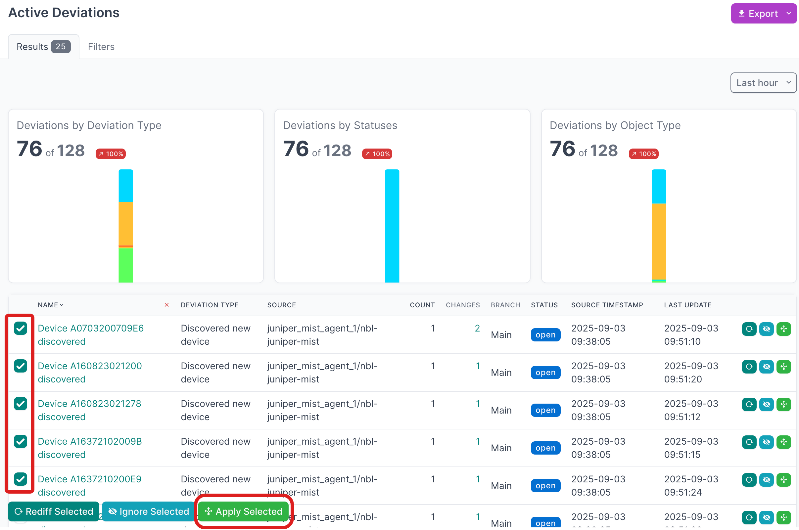
3. Click **Apply X Deviations** to apply the deviations to the NetBox database:
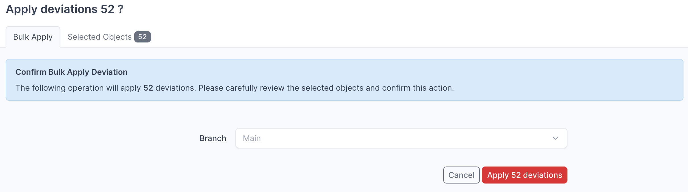
:::tip[Apply Deviations to a Branch]
  Instead of writing the deviations to the `Main` NetBox database branch, you can select another branch from the drop down menu and apply the deviations to that branch. 

:::
:::info[Assurance Docs]
  For more detailed information on working with NetBox Assurance, please refer to the [documentation](../../../assurance/index.md)

:::
## View the Juniper Mist Data in NetBox
Now that you have run the integration at least once and applied the discovered data, you can view the data from Mist in the NetBox UI
1. Start by clicking on **Organisation → Tenants** in the main navigation menu, select the Tenant for your Mist Organisation, then click **Devices**: 
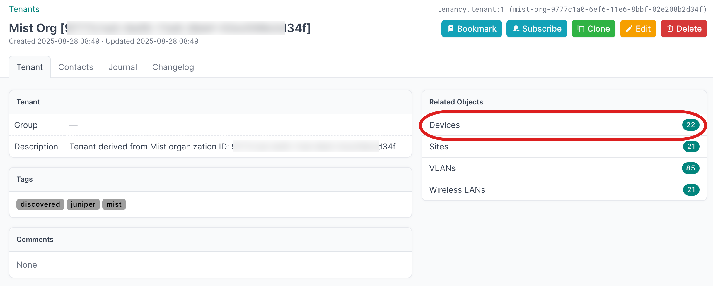
2. Select an individual Device to view the details:
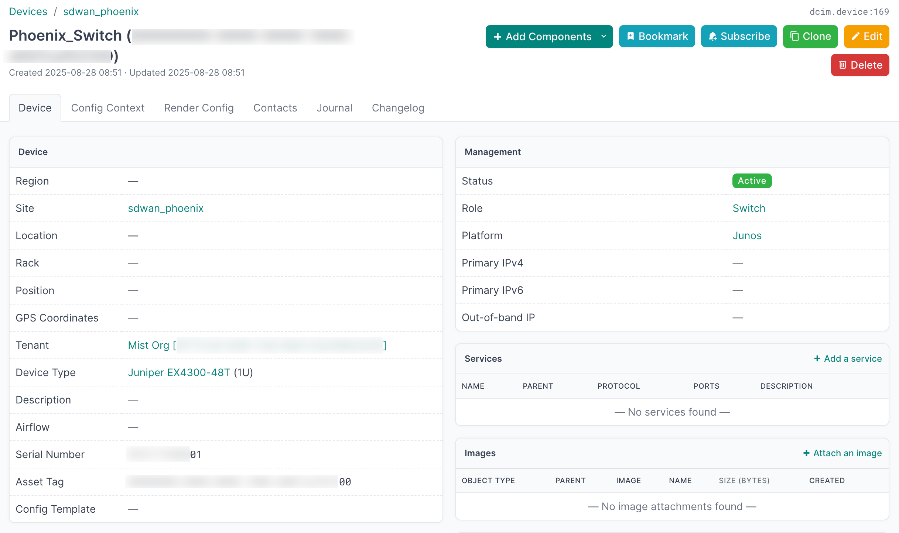

---
## Additional Resources

### Related Documentation
- [NetBox Assurance Documentation](https://netboxlabs.com/docs/console/netbox-assurance/)
- [Orb Agent Documentation](https://github.com/netboxlabs/orb-agent)

### Support
Email [support@netboxlabs.com](mailto:support@netboxlabs.com) for support.
