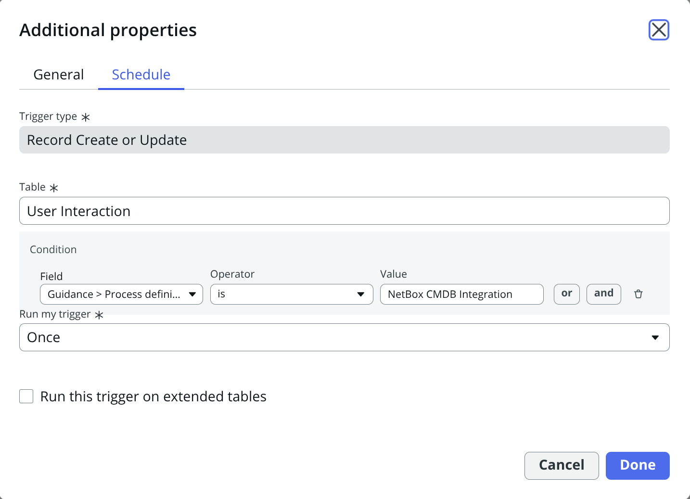
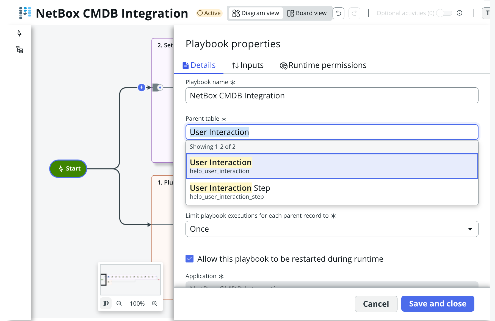
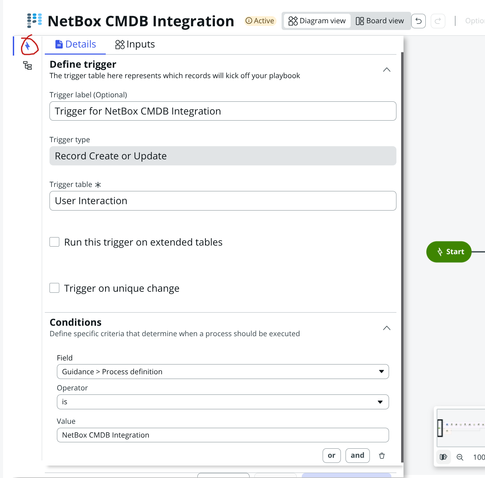

# Known Issues

This document lists known issues in the NetBox CMDB Integration application along with workarounds and resolution plans.

## Version Information
- **Application Version**: 1.4.0
- **ServiceNow Compatibility**: Certified for Yokohama and Zurich versions.
- **Last Updated**: January 2026

---

## Version 1.4.0

### Issue 1: Update Set Preview or Commit have collisions or warnings

**Severity**: Low  
**Component**: Update Set Installation

**Description**:  
During Update Set preview or commit, ServiceNow warns that some collisions are present and must be resolved before commit, or that some objects will be deleted when committing.

**Impact**:  
This warning appears during the update set preview or commit phase but does not affect functionality.

**Workaround**:  
Accept all the remote updates, and give consent to any warnings of deletions when prompted before commit. The application will function correctly after installation is complete.

**Status**: Known limitation - No fix planned (cosmetic issue only)

---

### Issue 2: Guided Setup Blank Page After Pre-Installation Checklist

**Severity**: Medium  
**Component**: Guided Setup

**Description**:  
The NetBox Guided Setup will not start properly, displaying a blank page after the pre-installation checklist.

**Impact**:  
Users cannot proceed with the guided setup wizard after the initial checklist screen.

**Workaround**:  
To fix this issue, follow the procedure below:

- In Application Manager, upgrade the Guided Setup and Playbook Experience components to their latest versions
- Switch to the NetBox CMDB Integration application scope
- Open the NetBox CMDB Integration Guided Setup in edit mode using Guided Setup Builder
- Continue and select the Diagram view
- Locate the playbook trigger on the left and click on it
   - In Yokohama and Zurich, it is labeled Start
- Modify the record as such:
   - In Yokohama:
      - fill the form as pictured
      
      

   - In Zurich, follow these two steps:
      - Set the Parent table to User Interaction (help_user_interaction), as pictured
      
      
      
      - Click on the trigger icon and fill the form as pictured
      
      
      
- Save and close the modified records
- Activate, then Finalize the playbook
- Navigate to help_user_interaction.list
   - Delete any records refering to NetBox CMDB Integration
- Switch back to Global scope
- Start The NetBox Guided setup again from All > NetBox > Configuration > Guided setup

**Status**: Under investigation

---

## Reporting Issues

If you encounter any issues not listed in this document:

1. **Check the FAQ**: Review the [FAQ and Troubleshooting](snow-faq.md) guide for common problems
2. **Check Logs**: Review NetBox Logs in ServiceNow under **All > NetBox > Maintenance > NetBox Logs**
3. **Contact Support**: Reach out to NetBox Labs support with:
   - Application version
   - ServiceNow version
   - Detailed description of the issue
   - Steps to reproduce
   - Relevant log entries

---

## Previously Resolved Issues

Issues resolved in previous versions are documented in the [Release Notes](release-notes.md).
